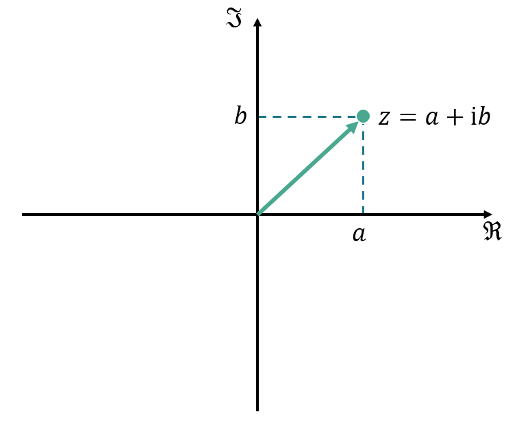
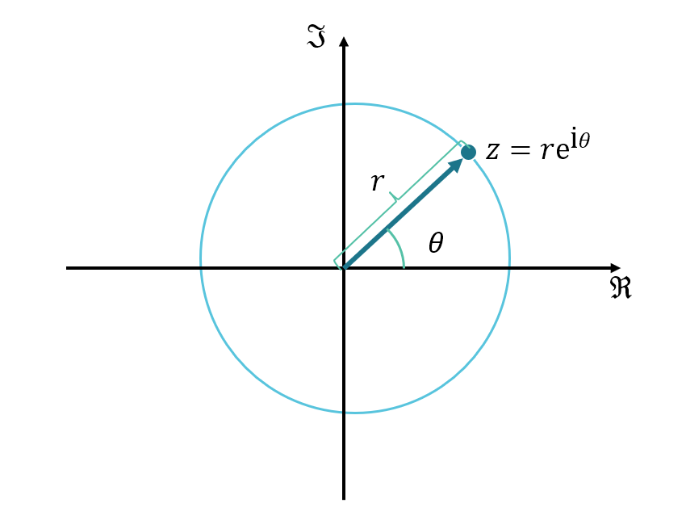
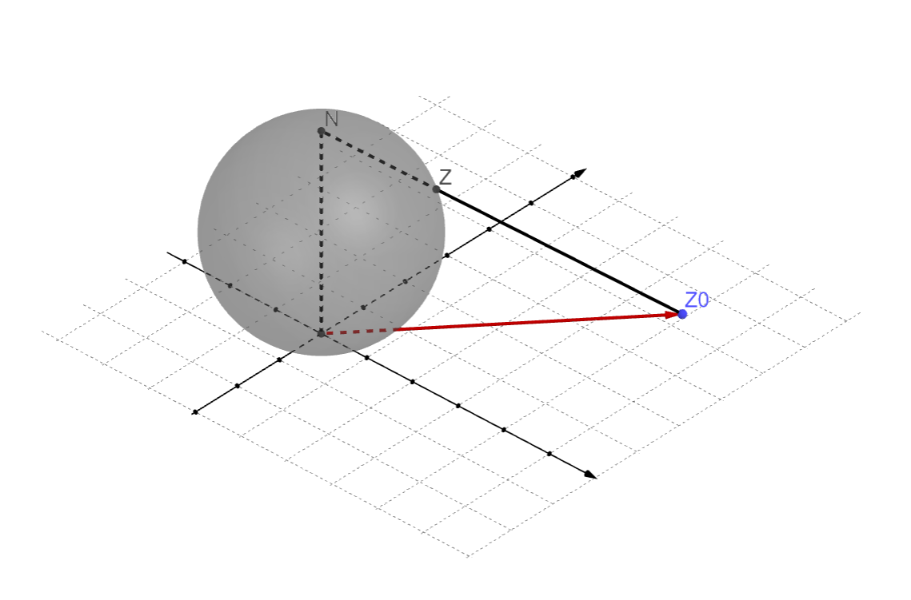

# 从复数开始

##  虚数单位 $$\mathrm{i}$$(Imaginary)

有同学说了，这个咱们高中数学就学过
$$
\mathrm{i}^2 \equiv -1
$$
不过对于初学者看来, 这个非常「抽象」的数学概念怎么就和物理扯上关系了. 特别对物理学生来说, 学个数学概念就一定要联系到物理上,以达到一种「直观」. 其实这种问题在学习复变函数时完全没有必要,下面是常见问题

1.   虚数i的物理意义是什么？

     冇啦, 虚数就是数学用来拓展实数以构成复数域的。不过复数域上有很多运算性质可以用到物理与工程之中。

2.   那我该如何理解复数呢？

     不需要，记住性质和运算就行了。但是有的时候根据其性质和应用情况可以等效成诸如复平面上的矢量等。

得益于虚数的引入, 我们将实数域进行了拓展——复数域.

## 复数域 $$\mathbb{C}$$

### 这也是复数啊?

>   **Axiomatic定义:复数/复数域**
>
>   **复数(Complex Number)**定义为实数$$a, b$$组成的有序对, 而其相关之和及积为：
>
>   $$(a,b)+(c,d)=(a+c,b+d)$$
>
>   $$(a,b)\cdot(c,d)=(ac-bd,bc+ad)$$
>
>   复数数系是一个域,复数域常以$$\mathbb {C} $$ 来表示.
>
>   复数域亦可定为代数数的拓扑闭包或实数域的代数闭包.

这是什么东西?怎么和虚数单位$$\mathrm{i}$$一点关系都没有了?

不要急, 接下来我们将诸如形式 $$(a,b)$$ 替换为熟悉的 $$a+\mathrm{i}b $$ 进行计算:
$$
\begin{align}
\mathrm{If\ we\  have}:\mathrm{i}^2&\equiv -1\\
a+\mathrm{i}b +c+\mathrm{i}d  &=a+c +\mathrm{i}(b+d)\\
(a+\mathrm{i}b)\cdot (c+\mathrm{i}d)&=ac+\mathrm{i}ad+\mathrm{i}bc+bd\mathrm{i}^2\\
&=(ac-bd)+\mathrm{i}(ad+bc)
\end{align}
$$
和**定义: 复数/复数域**一致, 也就是说$$a+\mathrm{i}b$$ 是可以作为复数进行运算的,从发展来说,虚数单位 $$\mathrm{i}$$ 产生自三次方程的求解, 历史演化后才有复数域 , 随着数学的公理化进程, 复数也被抽象成了上面的模样.

不过公理化还是很有必要的.由于存在矩阵$$\begin{bmatrix} a&-b \\b&a\end{bmatrix}$$满足 **定义:复数/复数域** 的条件(读者自证), 复数 $$a+\mathrm{i}b$$ 也可以化成矩阵形式来进行一系列运算.这是一个实用意义不大,但是具有数学意义的表达式. 

如果现在起让大部分学生使用矩阵形式表示复数, 一定会听到许多不满声. 大部分原因是因为矩阵运算太复杂了[^2].我们熟知的 $$a+\mathrm{i}b$$ 方便,但也不完全方便.这玩意的除法公式长这样:
$$
\frac{x_1+\mathrm{i} y_1}{x_2+\mathrm{i}y_2}=\frac{x_1x_2+y_1y_1}{{x_2}^2+{y_2}^2}+\mathrm{i}\frac{x_2y_1-x_1y_2}{{x_2}^2+{y_2}^2}
$$

要解决这个问题,我们得借助Euler的力量.

此处我们再定义两个函数$$\Re(z)$$($$\mathrm{Re}(z)$$)和$$\Im(z)$$($$\mathrm{Im}(z)$$):
$$
\begin{align}
z&=a+\mathrm{i}b\\
\mathrm{def}:\Re(z)&\equiv a\\
\Im(z)&\equiv b
\end{align}
$$
我们称实数$$a$$为复数的**实部**, 实数$$b$$为复数的**虚部**. 

无论是$$z=a+\mathrm{i}b$$还是$$\begin{bmatrix} a&-b \\b&a\end{bmatrix}$$,实质是有序实数对$$(a,b)$$. 很明显我们想到用 **平面直角坐标系** 来表示每一个复数, 这个平面我们称之为**复平面(Complex plane)**

 

`复平面、复数、矢量示意图`

一般令横轴为实轴$$\Re$$,纵轴为虚轴$$\Im$$. 复数$$z=a+\mathrm{i}b$$可以表示为**复平面中的**矢量.请注意, 学过多元函数的同学不要简单的就将复平面与多元函数联系起来, 此处的「矢量」其实具有相当多的性质. 因此本书的复平面记号也采用的是$$\mathbb{C}$$而不是$${\mathbb{R}^2}$$. 但为了方便,我们可以使用**笛卡尔形式**来表示复数:
$$
z=x+\mathrm{i}y
$$

### 救世啊, Euler

>    The most remarkable formula in mathematics. 
>
>    ----Richard Phillips Feynman

**Euler公式:**
$$
e^{\mathrm{i} \theta}=\cos \theta +\mathrm{i}\sin \theta
$$

 更为公众所知的应该是欧拉恒等式$$e^{\mathrm{i}\pi} +1=0$$,几乎能在各种科普中看到它[^5]. 费曼称之为恒等式为「数学最奇妙的公式」.具体证明[^3]过程略 . 比对Euler公式与刚才复数的形式$$z=x+\mathrm{i}y$$轻松的可以的到:
$$
\begin{align}
\exists\  r&\in \mathbb{R}\\
\frac{z}{r}&= \frac{x}{r}+\mathrm{i}\frac{y}{r}\\
&=\cos \theta+\mathrm{i}  \sin \theta    \\
&=e^{\mathrm{i}\theta  }\\
z&=re^{\mathrm{i} \theta }
\end{align}
$$
这就是复数的**指数形式**[^6],其中我们称$$r$$为复数的**模长**, $$\theta$$为复数的**辐角**.在复变函数的学习中,两种形式是等价的,即:
$$
\begin{align}
re^{\mathrm{i}\theta }&\Leftrightarrow a+\mathrm{i}b\Leftrightarrow z \\
r&=\sqrt{a^2+b^2} =|z|\\
\theta &=\arctan \frac{b}{a}=\arg z +2k\pi \ \ k\in\mathbb{Z}
\end{align}
$$
$$|z|$$是复数z的**绝对值/模长/幅值**[^7],定义为复数在复平面上与原点的距离;$$\arg z$$是复数的**主幅角**,是与$$\Re$$的夹角,且$$\arg z\in [-\pi,\pi]$$ .

自然的, 我们容易想到将$$re^{\mathrm{i}\theta}$$ 作为极坐标$$(r,\theta)$$ 在复平面中进行表示:

`极坐标下的复数`

有了指数形式的复数,我们能极大的简化目前的乘/除法公式:
$$
\begin{align}
z_1\cdot z_2&=r_1e^{\mathrm{i}\theta_1}\cdot r_2e^{\mathrm{i}\theta_2}=r_1r_2 e^{\mathrm{i}(\theta_1+\theta_2)}\\
\frac{z_1}{z_2} &=\frac{r_1e^{\mathrm{i}\theta_1}}{r_2e^{\mathrm{i}\theta_2}}=\frac{r_1}{r_2}e^{\mathrm{i}(\theta_1-\theta _2) }
\end{align}
$$
乘法乘法其在复平面上的表现就是两复数的辐角相加, 模长相乘;除法类似. 而且由于极坐标$$\theta$$具有周期性, 指数形式的复数也会出现周期性.

### Infinity $$\infty$$ & Zero $$0$$

>   **Axiomatic定义:实数/实数域**:
>
>   所有实数的的集合定义为$$\mathbb{R}$$,则:
>
>   1.集合$$\mathbb{R}$$是一个域:可以作加、减、乘、除运算, 且有如交换律, 结合律等常见性质
>
>   2.且域$$\mathbb{R}$$是个有序域, 存在全序关系≥,对所有的实数x, y , z:
>
>   (1) $$\mathrm{If:} x\ge y\ \ ,\mathrm{Then}:x+z\ge y+z;$$
>
>   (2) $$\mathrm{If:} x\ge 0\ \mathrm{and}\ y\ge 0 \ ,\mathrm{Then}:xy\ge 0.$$
>
>   3.Dedekind完备性: 任意$$\mathbb{R}$$的的非空子集$$S(S\subseteq \mathbb{R},S\neq \varnothing )$$, 若$$S$$在$$\mathbb{R}$$内有上界,那么$$S$$在$$\mathbb{R}$$内有上确界.
>
>   
>
>   所以无穷大其实不是实数啦...

在$$\mathbb{R}$$中,0是数轴原点.而在$$\mathbb{C}$$中,0也是复平面的原点.由于指数形式的特殊性,明显的,复数0的辐角没有明确定义.在笛卡尔形式的复数0定义如下:
$$
z=0\Leftrightarrow \Re(z)=\Im(z)=0
$$

0很简单,但是在接下来的学习中,涉及到$$\infty$$的都很困难.  在微积分中, 我们已经遇到过不少无限了:在积分中我们需要对无限小作运算;在级数中我们还会使用无穷项数累加.我们不妨如图所示,利用「圆极投影」将实数域$$\mathbb{R}$$上的每个数**映射**到「圆」上.很明显$$\theta$$的取值范围应该为$$(-\pi,\pi)$$,是一个开集. 数学上为了得到实数的「一点紧致化」,我们引入$$\infty$$,并对应$$\theta=\pi $$这一点.这样我们的「圆」就具有了连续性.

`通过射影几何得到的扩展实数圆`

我们原有的实数集$$\mathbb{R}$$加上$$\infty$$ (「两点紧致化」时是$$+\infty$$和$$-\infty$$),构成了我们的**扩展实数集** /广义实数 ,符号记作$$\bar{\mathbb{R}}$$.由于无穷不满足一般的代数规则,因此扩展实数域不是一个代数域.

有了实数的基础,我们面对复数就要更加轻松. 仿照实数域扩展实数圆的构造, 如下图所示,我们在复平面上方放置一个球/单位球, 并将复平面上的点通过**球极投影**的方式映射到球面上.此时复平面上的点(例$$z_0$$)应与**除N顶点以外的球面点**(例$$z$$)一一对应.令N点为 **无穷远点**/无限远点 以补全球面(复平面的一点紧致化),此时的球面称为**复球面**,此时的复球面点的集合由复数域$$\mathbb{C}$$与无穷远点$$\infty$$构成,我们称之为**扩充复数**,符号为$$\hat{\mathbb{C}}$$ . 注意, 由于无穷远点也和一般的代数规则不符,故也不是一个代数域.

`复球面球极投影示意`

也就是说, 无穷远点也不是一个复数. 自然的, 无穷远点的模长为无限大, 其辐角没有明确意义. 

在此后的学习中,我们的讨论会屡次涉及到无穷远点.由于复平面实际不包含无穷远点, 所以在涉及到无穷远点的讨论时, 应使用包含全体扩充复数的复球面. 

### 复数的矩阵形式

一般来说,我们可以把矩阵当作线性变换.在二维平面上, 如果一个矢量左乘矩阵$$\begin{bmatrix}x_1&x_2\\y_1&y_2 \end{bmatrix}$$ , 可以看作是对整个平面仅经过均匀拉伸、旋转, 将坐标轴的基矢量$$\vec{i}$$、$$\vec j$$变换到$$\begin{bmatrix}x_1\\y_1 \end{bmatrix}$$、$$\begin{bmatrix}x_2\\y_2 \end{bmatrix}$$后平面的线性变换. [^4]

`线性变换示意` 

由 **Euler公式** 有
$$
e^{i\theta}=\cos \theta +\mathrm{i}\sin \theta
$$
其中 $$\cos \theta+\mathrm{i} \sin \theta$$ 是一个复数,考虑转换为矩阵形式的复数,就可以得到 $$\begin{bmatrix} \cos \theta&-\sin \theta \\\sin \theta & \cos \theta \end{bmatrix}$$  ,正好是二维的旋转矩阵——其表现为将矢量逆时针旋转$$\theta$$.设一个在实轴上的矢量$$\begin{bmatrix}r\\0 \end{bmatrix}$$,以便与实数$$r$$对应. 则复数的指数形式$$re^{\mathrm{i}\theta}$$即为:
$$
\begin{bmatrix} \cos \theta&-\sin \theta \\ \sin \theta & \cos \theta \end{bmatrix}\begin{bmatrix}r\\0 \end{bmatrix}=\begin{bmatrix}r\cos \theta\\r\sin \theta\end{bmatrix}
$$

 这里展示了复数在复平面上其实可以作为旋转矢量来看待. 在复平面上,我们想让矢量转$$\theta$$,只需要乘上$$e^{\mathrm{i}\theta}$$即可. 同时,当$$r$$取1时,$$\begin{bmatrix}\cos \theta\\\sin \theta\end{bmatrix}$$ 可以看作单位圆上的点, 以后看到$$e^{\mathrm{i}\theta}$$应该本能的想到单位圆.

由此可见, 复数是个性质很好的计算工具. 这种性质在Fourier/Laplace变换中大放光彩, 同样的在波函数中也有重要的应用, 毕竟不仅能简化公式, 还能方便计算的数学工具谁 能 拒 绝 呢. 由于其旋转的特性, 在处理多值函数时我们也能找到合适的数学工具.

## 复数运算

>   数学没有计算,就像先辈没有林檎,罗马没有张家口,西方没有耶路撒冷.

相信到此时,你对复数的性质已经了解的足够多了. 作为物理系学生, 在实际的应用环节中, 你通常并不是在给别人推销自己所学的知识, 而是陷在计算的深渊之中. 

1.   如何学习复数运算呢?靠刷完吉米多维奇吗?

     你是新时代的大学生了, 应该停止这种无意义的内耗.你所需要的仅仅是记住规则,然后嗯算就行了.

2.   遇到嗯算很难算的怎么办呢?

     用Mathematica算.

### 复数运算法则

对于复数域$$\mathbb{C}$$来说,这是一个代数数域[^8].故满足以下一般代数规律:

**相等 =**

笛卡尔形式:	$$\Re(z_1)=\Re(z_2),\Im(z_1)=\Im(z_2)\Leftrightarrow z_1=z_2$$

**加法   + **

交换律:		$$z_1+z_2=z_2+z_1$$

结合律:		$$(z_1+z_2)+z_3=z_1+(z_2+z_3)$$

**乘法   $$\cdot$$**  

交换律:		$$z_1\cdot z_2=z_2\cdot z_1$$

结合律:		$$(z_1\cdot z_2)\cdot z_3=z_1\cdot(z_2\cdot z_3)$$

分配律:		$$z_0\cdot(z_1+z_2)=z_0\cdot z_1+z_0\cdot z_2$$

和实数具有一样的运算规律呢. 

### 共轭复数

对于复数$$z=x+\mathrm{i}y$$,我们将其虚部$$\Im$$取相反数, 从而得到的在复平面上与原复数关于实轴轴对称的复数,我们称之为**共轭复数**,记作$$\bar {z}$$.
$$
\begin{align}
z&=x+\mathrm {i}y=re^{\mathrm{i}\theta  }\\
\bar{z}&=x-\mathrm{i} y=re^{-\mathrm{i}\theta }   
\end{align}
$$
其有以下性质:
$$
\begin{align}
1.&\ z\cdot\bar{z}={|z|}^2;\\
2.&\ \bar{\bar{z}}=z\ ;\\
3.&\ \overline{z_1\pm z_2}=\bar{z_1}\pm \bar{z_2}\\
4.&\ \overline{z_1 \cdot z_2}=\bar{z_1}\cdot \bar{z_2}\\
5.&\ \overline{(\frac{z_1}{z_2}) } =\frac{\bar{z_1}}{\bar{ z_2}} 
\end{align}
$$
在平时会经常利用性质1来求复数的模长. 

### 模与辐角运算

我们首先回顾复数三种形式的互换

>复数的**笛卡尔形式**、**三角形式**、**指数形式**
>$$
>z \Leftrightarrow x+\mathrm{i}y \Leftrightarrow r(\cos \theta +\mathrm{i}\sin \theta)\Leftrightarrow re^{\mathrm{i}\theta  }
>$$

其模与辐角的运算应具有如下规则:
$$
\begin{align}
|z_1\cdot z_2|=|z_1||z_2|,\left | {\frac{z_1}{z_2}} \right |=\frac{|z_1|}{|z_2|}\ \  (z_2\neq 0)\\
\arg(z_1\cdot z_2) =\arg z_1+\arg z_2\\
\end{align}
$$
且满足三角不等式(请读者自证):
$$
\begin{align} |z_1|+|z_2|&\ge|z_1+z_2| \\|z_1|-|z_2|&\le |z_1-z_2|\end{align}
$$

---

一般的教材到此时就该讲复数的幂次与开方了. 但由于本书认为数物中所学的幂次/开方实际上是初等复变函数,故不置于复数运算中讲解.