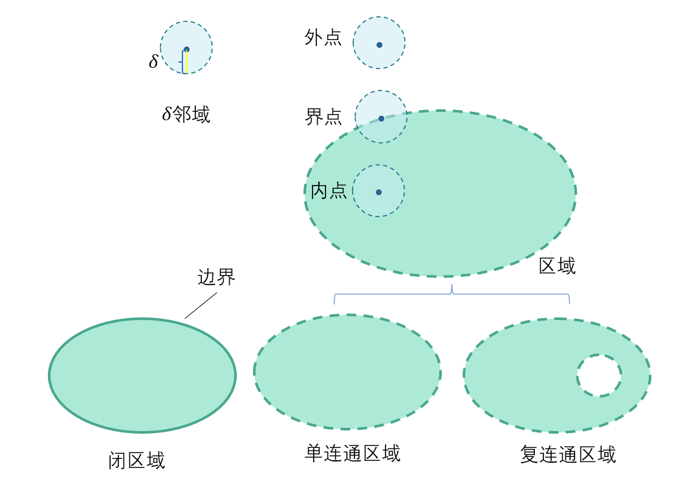
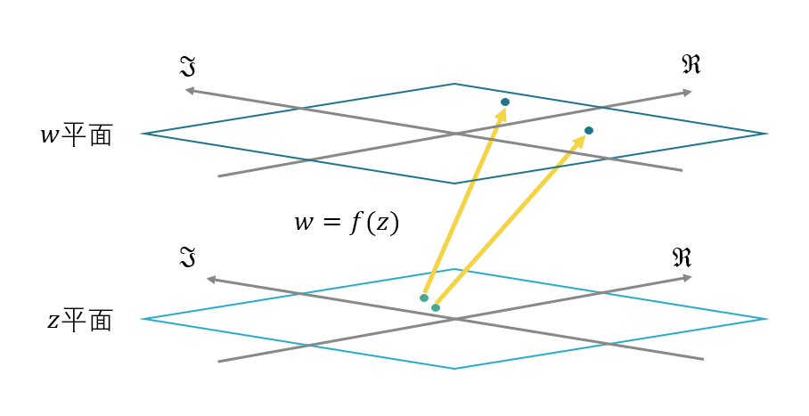
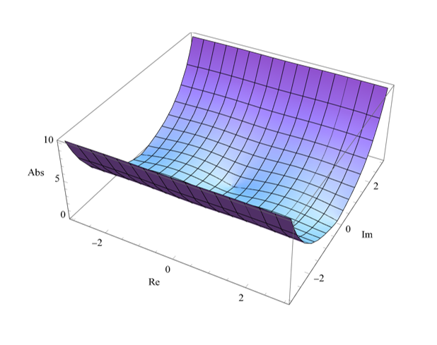
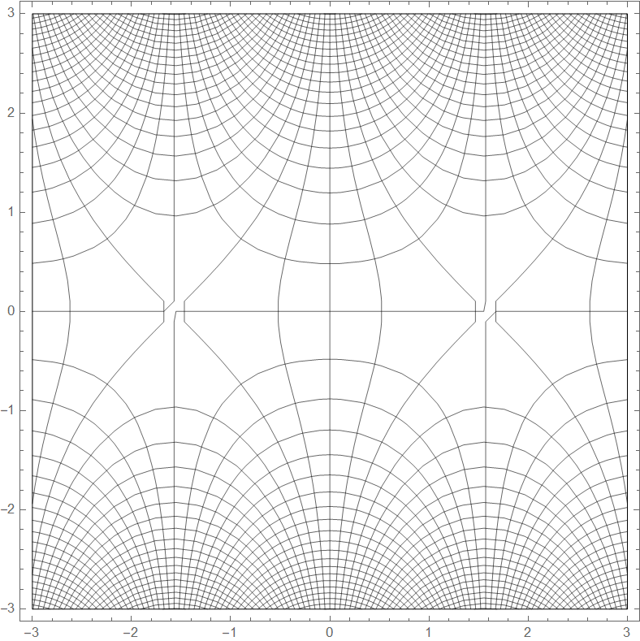
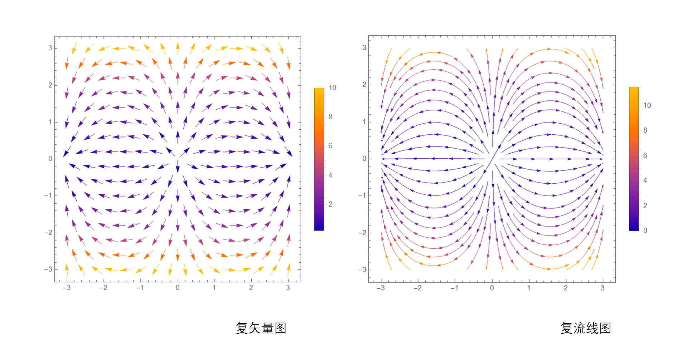
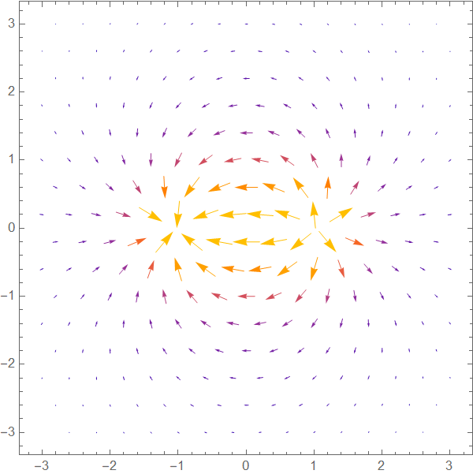

# 进入函数世界

如果用林檎来进行比喻,  那么在学习函数前就是关心林檎具体的数量, 而引入函数后我们关心的就是林檎与林檎树之间的关系以及这种关系的性质. 数学中起决定因素的其实不是元素本身，而是元素之间的关系. 自然的,在学习复变函数的过程中, 我们会引入函数的概念到复数域中.

## 复变函数 

### 对它使用函数吧

我们首先回味一下函数的定义:

>   **Axiomatic定义: 函数**:
>
>   有从输入值集合$$X$$到可能的输出值集合$$Y$$的一个**函数**$$f$$(记作$$f:X\rightarrow Y$$)是一个关系,满足以下条件:
>
>   1.$$f$$是**完全**的: 对于集合$$X$$中任意元素$$x$$都有集合$$Y$$中的元素满足$$y=f(x)$$.
>
>   2.$$f$$是**多对一**的:  多个输入可以映射到一个输出,但一个输入不能映射到多个输出.

很明显的,要想在复数域上使用函数, 只需要把输入值集合$$X$$与输出值集合$$Y$$扩展到复数域上就行.这就是**复变函数**,我们记作:
$$
w=f(z)\ \ \ \ (z\in D)
$$
称$$z$$为**自变量**,$$D$$为**定义域**.对于复变函数来说, 自变量与因变量也可以可以分为实部与虚部:
$$
\begin{align}
z&=x+\mathrm{i}y;\ \ \ \ \ x,y\in\mathbb{R}\\	
w&=f(z)=u(x,y)+\mathrm{i}\ v(x,y) ; \ \ \ u,v\in\mathbb{R}
\end{align}
$$
其中$$u,v$$是函数$$f(x)$$的成分.复变函数$$w=f(z)$$可以看作是两个实变函数$$u,v$$的有序对.

### 点,点集与区域

由于本段概念非常显然,我们直接给出定义

>   **Definition:Gebiet**. Eine offene Punktmenge heißt zusammenhängend, wenn man sie nicht als Summe von zwei offenen Punktmengen darstellen kann. Eine offene zusammenhängende Punktmenge heißt ein Gebiet.
>
>   — Constantin Carathéodory, (Carathéodory 1918, p. 222)

这段是历史上对于**区域(Domain)**的定义.译文:「如果一个开集不能表达为两个开集的和,就说明这个开集是**连通**的.这个**开集**称为区域」. 这个定义转为更加现代化的表述就是如下:

**定义:$$\delta$$邻域**
$$
U(a,\delta)=\{ x|\ |x-a|<\delta \}
$$
**定义:去心邻域**
$$
U_0(a,\delta)=\{x|\ 0<|x-a|<\delta \}
$$
**定义: 区域**

设有非空平面点集$$D$$,如满足:

1.   **开集性**:在$$D$$中的每一点$$z$$, 存在$$\delta$$邻域全含于$$D$$;
2.   **连通性**:在$$D$$中任意两点都能用折线连接起来,且折线上的点都属于$$D$$.

则称$$D$$为**区域**.

邻域也是区域.

同时我们快速给出以下定义:

**定义:内点/外点**

若点$$z$$存在邻域全含于$$D$$,则称为**内点**,也称点$$z$$**属于**$$D$$;

若点$$z$$存在邻域全不含于$$D$$,则称为**外点**;

**定义:界点/边界**

若点$$z$$不属于$$D$$,但其任意邻域包含$$D$$的点,则称为**界点**.

$$D$$所对应的界点的集合叫做$$D$$的**边界**.

**定义:闭区域**

区域与其边界的并集称为**闭区域**,记作$$\overline{D}$$

**定义:单连通区域/复连通区域**

若区域内任何一条全含于区域的简单闭合曲线都能收缩为一点,则称为**单连通区域**.

反之为**复连通区域**.

以上内容关系如下:

`邻域/区域/闭区域示意`

### 复变函数可视化

对于之前所学的一元函数多元函数来说, 函数图像无疑是非常方便的分析工具: 我们可以从图像中直观的看到函数的零点,看得出函数的变化趋势, 看得出积分区域的实际意义(面积/体积).可以说, 函数图像为函数赋予了集合直观. 然而这种直观在复变函数中遇到了挑战: 我们知道复变函数实际上是两个复数域的一种映射:

`z平面向w平面的函数`

在表示一元函数$$y=f(x)$$的图像时, 实际上是表示在二维平面上点$$(x,f(x))$$的集合; 表示二元函数$$z=f(x,y)$$时, 表示的是在三维空间中$$(x,y,f(x,y))$$点的集合. 如果要我们表示$$w=u+\mathrm{i}v=f(x,y)$$的话,我们就需要在四维空间中表示$$(x,y,u(x,y),v(x,y))$$点的集合了.我们只能感受三维空间, 是不是就没有办法了呢?

我们使用$$w=\sin z$$作为实例进行演示.我们可以将三维空间的x轴,y轴作为z平面的实轴与虚轴. 将z轴设定为函数$$w=f(x,y)$$的模长$$|w|$$,这样就只用表示$$(x,y,|f(x,y)|)$$在三维空间中的点了.

`|sin(z)|的图像`

但是这种可视化方法也有缺点:由于将因变量$$w\in \mathbb C$$换成了一个实数来表示, 进行了「降维打击」, 函数图像也会损失了一些信息(如辐角等). 此时的函数图像具有的性质实际上就不多了.

让我们换个思路, 总之都是复平面到复平面,借助之前线性变化的方法, 如果我们把原来平面上的网格的每一个点移动到变换后的位置,是不是也能表示复变函数呢?如此我们可以绘制网格图. 

`sin(z)的网格图`

如果我们把因变量$$w=u+\mathrm{i}v$$看成一个在复平面上的矢量$$\mathbf{w}=\begin{bmatrix}u\\v \end{bmatrix}=f(x,y)$$,那此时我们就得到了一个复平面上的矢量场:
$$
\mathbf{w}=\mathbf{F}(x,y)
$$
如此, 我们可以在复平面上$$(x,y)$$点上画出矢量$$\begin{bmatrix}u\\v \end{bmatrix}$$. 当然如果直接画矢量的话, 它们会互相遮挡, 所以我们将长度缩短,并用颜色来区分其模长. 如此我们就能得到复矢量图/复流线图:

`sin(z)的复矢量图与复流线图`

虽然有如此多的方法对复变函数进行可视化,但与之前一元函数中图像的作用相对比,无论哪一种方法的实用性都大不如从前.事实是, 我们正在失去几何直观.

不过这些可视化在此后依然有其应用价值,我们将会在后续篇章讲解.

## 解析函数

复变函数实际上是一个很广泛的概念, 其中不乏有一些难以研究或缺少应用价值的.对于学物理的同学而言, 只需要研究其一类具有「神奇」特性的函数——复变函数. 

### 微分之前

微分探讨的是自变量发生微小变动时, 因变量的变动情况. 这里有两个关键点: 一是如何取到足够小,小到极限那种;另一点是函数是否连续保证我们能得出其变动情况. 在一般的微积分学习中,路线是 极限->连续性->导数 ->微分 .这套流程照样可以搬到复变函数上.我们的重点是解析,这里主要以引入为主, 除了必要的推导,一般不做证明.

**定义:极限**

设函数$$w=f(z)$$在$$z_0$$的去心邻域$$0<|z-z_0|<\rho$$内有定义,$$\exists A\in \mathbb{C}$$,使$$\forall\varepsilon>0,\exists \delta >0,$$对满足$$0<|z-z_)|<\delta (0<\delta\leq\rho)$$的一切$$z$$,都有:
$$
|f(z)-A|<\varepsilon
$$
则称$$A$$为函数$$f(z)$$当$$z$$趋于$$z_0$$的**极限**,记为:
$$
\lim_{z\rightarrow z_0} f(z)=A
$$
**定义:连续**

若$$z_0\in D$$定义域,有$$\lim\limits_{z\rightarrow z_0}=f(z_0)$$,则称函数在这一点连续.

下面引入Cauchy的定义

>   $$\varepsilon-\delta$$**定义:连续**
>   $$
>   \begin{align}
>   \mathrm{For:} &\ f(x)\ \ (x\in D
>   );c\in D, \varepsilon,\delta \in\mathbb{R};\\
>    &\forall  \varepsilon >0,\ \exists \delta >0 \\
>   \mathrm{If:} &c-\delta <x<c+\delta \\
>   \mathrm{Then:} &f(c)-\varepsilon <f(x)<f(c)+\varepsilon 
>   \end{align}
>   $$
>   称函数在这点连续.

>   $$\varepsilon-\delta$$**定义:一致连续**
>   $$
>   \begin{align}
>   \mathrm{We\ have:}&(X,d_1) \ (Y,d_2)\\ 
>   \mathrm{} &\ f:X\rightarrow Y\ \ ;x,y\in D, \varepsilon,\delta \in\mathbb{R};\\
>    &\forall  \varepsilon >0,\ \exists \delta >0 \\
>   \mathrm{If:}&d_1(x,y)<\delta  \\
>   \mathrm{Then:} &d_2(f(x),f(y))<\varepsilon 
>   \end{align}
>   $$
>   则我们称函数一致连续.
>   
>大致来讲是描述对于函数 $$f(x)$$我们只要在定义域中让**任意**两点 $$x$$ 跟$$ y$$ 越来越接近，我们就可以让 $$f(x)$$ 跟 $$f(y)$$ 无限靠近.

1

### 解析のレヴュー[^9]

>   わかります(指可微)

### 如果...不解析呢 | 解析的性质

### 调和的「巧合」

回顾前章将复变函数看作一个矢量场的想法:
$$
\begin{bmatrix}u\\v\end{bmatrix}=\begin{bmatrix}u(x,y)\\v(x,y)\end{bmatrix}=f(x,y)
$$
对于解析函数来说, 既然其分量的实部与虚部都是调和函数, 有没有可能这个矢量场是一个调和场?这个我们不难证明.

令函数为复平面上的一个场:$$\mathbf{w}(x,y)=u(x,y)\mathbf{\hat  i}+v(x,y)\mathbf{\hat j}$$,可得其散度/旋度:
$$
\begin{align}
\nabla \cdot\begin{bmatrix}u\\v\end{bmatrix}&=\frac{\partial u}{\partial x}+\frac{\partial v}{\partial y}\\
\nabla \times  \begin{bmatrix}u\\v\end{bmatrix}&=\frac{\partial u}{\partial y}-\frac{\partial v}{\partial x}  
  
\end{align}
$$
由Cauchy-Riemann条件:
$$
\begin{align}
\frac{\partial u}{\partial x} &= \frac{\partial v}{\partial y}\\
\frac{\partial v}{\partial x} &= -\frac{\partial u}{\partial y}\\
\end{align}
$$
带入后不难发现,其实场$$\mathbf{w}$$并不是一个无旋无源的场, 不仅有散度还有旋度.(想要找反例的读者可以想想$$f(z)=z$$在$$z=0$$ 处的散度).所以这只是个误会吗?

**Naive!**我们考虑对Cauchy-Riemann条件进行变形:
$$
\begin{align}
&\frac{\partial u}{\partial x} = \frac{\partial v}{\partial y};
\frac{\partial v}{\partial x} = -\frac{\partial u}{\partial y}\\
&\frac{\partial u}{\partial x}  - \frac{\partial v}{\partial y} = 0;\frac{\partial v}{\partial x}  + \frac{\partial u}{\partial y} = 0\\
\end{align}
$$
容易观察到:
$$
\begin{align}
&\frac{\partial u}{\partial x}  - \frac{\partial v}{\partial y} =\frac{\partial u}{\partial x}+\frac{\partial (-v)}{\partial y}  = \nabla \cdot \begin{bmatrix}u\\-v\end{bmatrix}=0;\\
&\frac{\partial v}{\partial x}  + \frac{\partial u}{\partial y} =\frac{\partial u}{\partial y}-\frac{\partial (-v)}{\partial x}  = \nabla \times \begin{bmatrix}u\\-v\end{bmatrix}=0;\\
&\begin{bmatrix}u\\-v\end{bmatrix}=\overline{\mathbf{w}}
\end{align}
$$
综上, 解析函数的复共轭函数所对应的矢量场正是一个**调和场**.其分量$$u,-v$$同样也是**调和函数**.而完成这一步之差一个**复共轭**操作.

接下来我们来应用一下.先来回忆一下流程:

1.   取共轭函数
2.   绘制复矢量图

其实很简单是吧,随后我们随便想一个函数,就:
$$
f\left( z \right) =\frac{1}{z-1}+\frac{-1}{z+1}
$$
我们绘制出其复共轭函数的复矢量图:

q

>   **插曲:**在学习矢量分析的时候, 我们接触到了诸如梯度场无旋, 旋度场无源等概念.在经历了无源无旋场(调和场)/有源无旋场/有旋无源场的轮番轰炸下,这些概念逐渐变得混乱. 当时有人称问我有没有「有源有旋场」, 一时间由于大脑的混沌状态并没有给出答案, 事后仔细一想:
>
>   **不 就 是 冲 马 桶 吗**
>
>   从此以后有源有旋场多了个「**马桶场**」的外号.

### 多值化的处理

### 初等解析函数

## 解析的应用

### 解析性质的意义

### 物理应用
