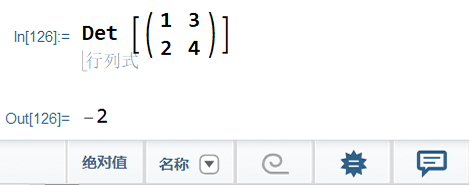
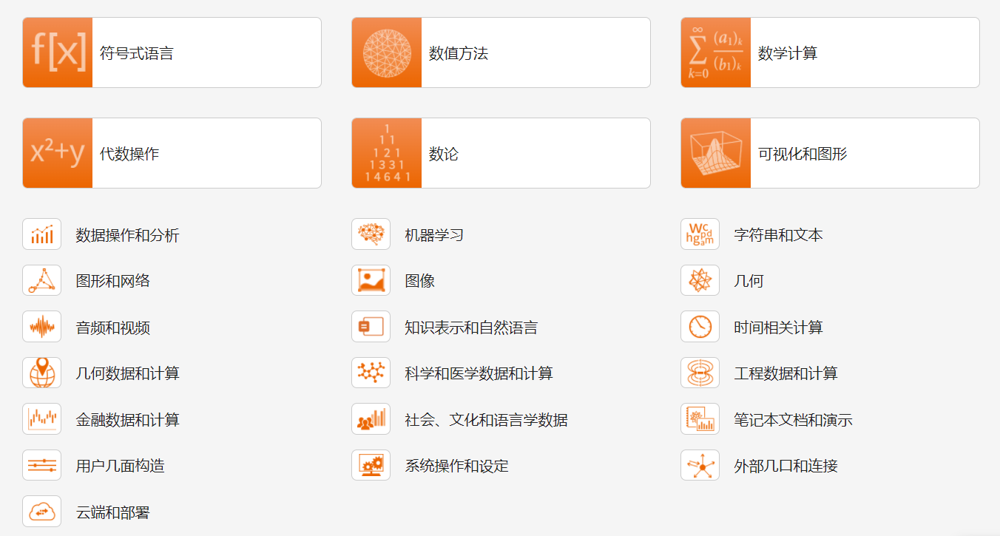

# Stat Software | 带学生软件推荐

作者/小吴 		

---


在阅读一本1987年的『21世纪新领域』[^1] 专辑时我发现, 25年前的人们全然没有预见到计算机和互联网的发展, 人们的. 我们的时代进步的如此之快, 以至于科技在仅仅一代人的时间就能颠覆生活的方方面面. 当前的时代已经被计算机所改变. 

大学生要与时俱进, 在我短暂的学习过程中我找到了一些能帮助大家高效~~摸鱼~~学习的软件.

本篇不是教程, 只是罗列一些软件及其优点. 想找教程的可以移步至对应的文章.说是推荐软件, 其实这个软件还挺广义的. 但是这些软件真的能帮助你的学习生活. 

---

## Wolfram Mathematica

CASIO fx-991CN X, 在我学习的过程中解决了不少计算问题, 也为我高效摸鱼起到了很大帮助. 在学习高数的过程中，我越发感觉有些力不从心. 要是有什么软件能一下子算出结果, 还能把函数图像画出来, 一定会有助于我摸鱼的.

> 神说, 要有光, 于是就有了Mathematica. 
>
> ---创世纪 1:3 

### Mathematica, 它好就好在...

那我为什么建议大学生都下个Mathematica来玩玩呢.

第一当然是因为它**简 单 啊**!

我知道很多学生学习软件最大的阻力是什么捏, 是 懒 啊. 你想想你买到的时候有没有认真阅读完说明书? [^2] 用化学试剂前查过MSDS[^3]了吗? 甚至看小说都不想看设定复杂的. 一个软件的学习时间要是太长了必然会提高其门槛. 

如果和学高等数学相比, Mathematica的入门难度就像数林檎一样简单. 如果指导得当一小时就能上手.我们用一段代码来举例子:

```mathematica
Plot3D[{x^2 + y^2}, {x, -2, 2}, {y, -2, 2}, 
 ColorFunction -> "RustTones"]
```

函数名简单,使用直观的类似英文的函数名称和一致明了的设计. `Plot3D[]`直译「绘图 3D」,就是画3D图形嘛. `ColorFunction`很明显就是「给函数上色的意思」.极佳的可读性降低了门槛, 编写起来就像呼吸一样轻松.

公式阅读简单.比如说在别的语言里分数只能委屈成除法,但是在Mathematica中只需要<kbd>Ctrl</kbd>+<kbd>/</kbd>就能实现分式,可以直接使用积分号来表示积分, 甚至连矩阵都能直接表示:



如此贴近自然书写格式让人无法拒绝. 这意味着只需要把你书上的题目抄到屏幕上就能得出结果. 在检查答案时可以纵览全局, 而不用盯着一堆括号瞎改.

第二是因为**立绘好看**啊. Mathematica不仅操作容易,直观易得,而且美观.Mathematica在科研软件中的审美水平独为一档,<kbd>Enter</kbd>+<kbd>Shift</kbd>按一下就能执行得到配色美观, 完美展现计算美学的结果.

第三是因为它**啥都能干**功能多多.要做傅里叶变换?冇问题, FourierTransform就行. 级数展开? 来来来, Series函数直接展.各种功能已经被封装好了在一个个函数里面,万能的<kbd>F1</kbd>键会告诉你所有函数的用法.你甚至能用Mathematica查看当天的股市.



那我为什么说Mathematica有助于学习呢? 你想啊, 要是我在学习微分几何时就用Mathematica在曲面上画出迪潘指标线不就秒懂了

## Markdown


## Axmath/MathType

>   拜托, 会latex真的是一件很酷的事


## Draw.io


## Origin


## Python


---

## END 尾声

互联网的发展是如此翻天覆地, 以至于蒙住了我们的双眼. 我们是否过于沉浸在信息流之中, 忘记了那个仰望星空的自己. 人类靠着智慧之实, 从高耸的珠穆朗玛到黑暗的马里亚纳都留下了印记, 向无限深空送出地球之声(Murmurs of Earth),在遥远的星球上探索生命的可能性. 人类从未放弃过探索.

面对着浩瀚的宇宙与无尽的时间, 人类显得如此渺小, 即便这样人类也没有选择蜷缩在山洞中苟活, 而是向黑暗中走去. 现在的我能理解万户:太空深邃似海, 我想畅游其中.每当晴天的晚上我都会抬头,凝望或有或无的星空.当我们离开大气层我们更能看见繁星. 宇宙如此璀璨瑰丽, 而科学能更清晰地窥见其美妙之处.对于人类来说, 科学的进步正是推进我们探索的动力.

学习科学的人们不应忘记自己热爱科学的心. 科学不是宗教, 它的尽头也不是神学. 科学是人类对世界的诠释, 其始终与现实与逻辑紧密结合.科学也不会否定自己的错误, 但贵在能改正并更加贴合实际. 科学也不会拒绝每一个热爱它的人. 科学始于对未知的探索, 科学也改变的我们探索的方式.但自始至终, 不变的是我们好奇的心.

我们对群星如此热爱,丝毫不惧黑暗之夜.


[^1]: 『日经产业新闻』长篇连载.新华通讯社 译


[^2]:建议现代人使用任何东西前都请看一看说明书. 


[^3]: 物质安全数据单(Material Safety Data Sheet )


