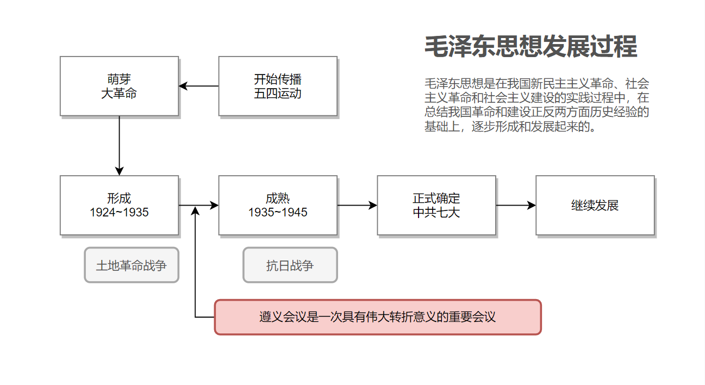
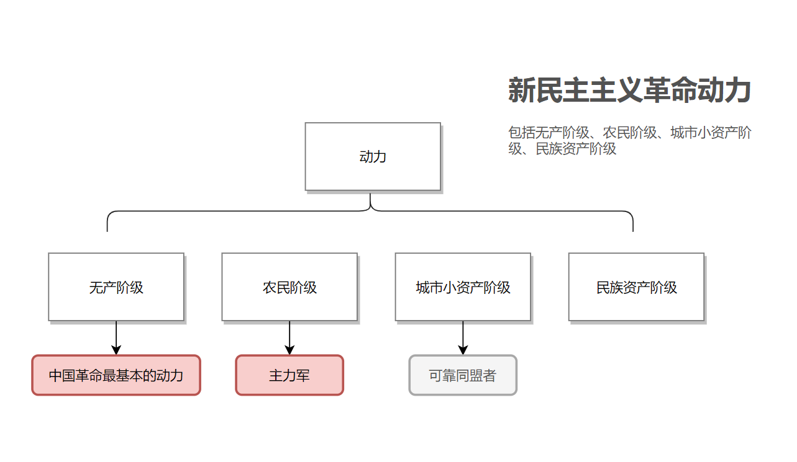

# 毛泽东思想和中国特色社会主义理论体系概论（2021版） 参考手册 上册

---

Guidance of *Conspectus of Maoism and Theoretical System of Socialism with Chinese Characteristics（2021）*  Part 1

第一版（Edition 1）

 

603 实验室 理论组

# 导论

### 马克思主义中国化首次提出

1938年毛泽东同志于党的六届六中全会上提出.

### 马克思主义中国化（三个就是）

马克思主义中国化：

1.   就是坚持把马克思主义基本原理同中国具体实际相结合、同中华优秀传统文化相结合，运用马克思主义的立场、观点、方法研究和解决中国革命、建设、改革中的实际问题；
2.   就是总结和提炼中国革命、建设、改革的实践经验，从而认识和掌握客观规律，为马克思主义理论宝库增添新的内容；
3.   就是运用中国人民喜闻乐见的民族语言来阐述马克思主义理论，使之成为具有中国特色、中国风格、中国气派的马克思主义。

# 第一章 毛泽东思想及其历史地位

>   要点：
>
>   -   毛泽东思想的主要内容和活的灵魂
>   -   毛泽东思想的历史地位

## 毛泽东思想形成与发展

### 毛泽东思想形成和发展的历史条件

帝国主义战争和无产阶级革命的时代主题是毛泽东思想形成和发展的**时代背景**

马克思列宁主义是毛泽东思想形成的**理论基础**

中国共产党人领导的中国革命和建设的实践是毛泽东思想形成和发展的**实践基础**

### 毛泽东思想形成发展的过程

## 毛泽东思想的主要内容和历史地位

### 把握毛泽东思想的主要内容和活的灵魂☆

毛泽东思想的主要内容有

1.   新民主主义革命理论;
2.   社会主义革命和社会主义建设理论;
3.   革命军队建设和军事战略理论;
4.   政策和策略理论;
5.   思想政治工作和文化工作理论;
6.   党的建设理论。

毛泽东思想的活的灵魂是 

**群众路线，独立自主，实事求是**

### 科学认识毛泽东思想的历史地位☆

1.   是马克思主义中国化的第一个重大理论成果
2.   是中国革命和建设的科学指南
3.   是中国共产党和中国人民宝贵的精神财富

# 第二章 新民主主义革命理论

>   要点：
>
>   -   新民主主义革命的总路线
>   -   新民主主义革命纲领的主要内容
>   -   新民主主义革命的三大法宝及其相互关系

### 近代中国主要矛盾与“三座大山”

主要矛盾：帝国主义和中华民族的矛盾（最主要）、封建主义和人民大众。

“三座大山”（中国革命的对象）：帝国主义、封建主义、官僚资本主义

### 新民主主义革命的实践基础

1.   旧民主主义革命的失败呼吁新的革命理论
2.   新民主主义革命的艰辛探索奠定了革命理论形成的实践基础

## 旧民主主义 与 新民主主义革命

### 区别

新民主主义:

1.   时代条件： 世界无产阶级社会主义革命的一部分
2.   领导力量：无产阶级先锋队——中国共产党
3.   指导思想：马克思列宁主义
4.   革命前途：社会主义

### 新民主主义革命的动力

## 新民主主义内容

### 新民主主义革命的总路线☆

新民主主义革命的总路线是：**无产阶级领导的，人民的大众的，反对帝国主义封建主义官僚资本主义**的革命。

### 新民主主义革命纲领的主要内容☆

1.   政治纲领，推翻帝国主义和封建主义的统治，建立一个无产阶级领导的，以工农联盟为基础的，各革命阶级联合专政的新民主主义的共和国
2.   经济纲领，i. 没收封建地主阶级的土地归农民所有，ii. 没收官僚资产阶级的垄断资本归新民主主义的国家所有，iii. 保护民族工商业
3.   文化纲领，新民主主义文化就是无产阶级领导的人民大众的反帝反封建的文化及民族的、科学的、大众的文化

### 新民主主义革命的三大法宝及其相互关系☆

三大法宝:统一战线，武装斗争，党的建设

三者关系: 统一战线和武装斗争是中国革命的两个基本特点，是战胜敌人的两个基本武器，统一战线是实行武装斗争的统一战线，武装斗争是统一战线的中心支柱，党的组织则是掌握统一战线和武装斗争这两个武器以实行对敌冲锋陷阵的英勇战士。

# 第三章 社会主义改造理论

>   要点：
>
>   -    新民主主义社会是一个过渡性社会的原因
>   -   过渡时期的总路线
>   -   社会主义改造的基本经验
>   -   中国确立社会主义基本制度的重大意义

## 过渡时期与社会主义改造道路

### 为什么说新民主主义是一个过渡性社会☆

新民主主义含有五种经济成分

1.   社会主义性质的国营经济 （主要）
2.   半社会主义性质的合作社经济
3.   农民和手工业者的个体经济（主要）
4.   私人资本主义经济（主要）
5.   国家资本主义经济

社会主义的因素不论在经济上还是政治上都已经居于领导地位，但非社会主义因素仍然有很大比重。

### 中国共产党在过渡时期的总路线☆

党在过渡时间总路线和总任务是，要在一个相当长的时期内，逐步实现国家的**社会主义工业化**，并逐步实现国家对农民对手工业和对资本主义工商业的社会主义改造。（一化三改）

体现社会主义建设和社会主义改造同时并举的路线，体现了社会主义工业化和社会主义改造的紧密结合，体现了解放生产力与发展生产力、变革生产关系与发展生产力的有机统一。 

### 过渡时期的理论依据☆

1.   马克思列宁主义关于过渡时期的理论，是过渡时期总路线提出的理论依据。 过渡时期 或 革命转变时期 这个特定的历史概念，是由马克思首先提出来的。 列宁根据俄国革命的实践，发展了马克思关于过渡时期的理论。无产阶级政党在这个时期的重要任务是，利用无产阶级专政的国家政权，建立社会主义经济，实现社会主义工业化。
2.   过渡时期的中国国情,，是过渡时期总路线提出的现实依据。新中国成立后，经过三年的国民经济恢复时期，新民主主义社会制度已经在全国范围内建立起来。

### 过渡时期的必要性

1.   我国经济和文化的落后，要求一个相当长的时期来创造为保证社会主义完全胜利所必要的经济上和文化上的前提;
2.   我国有极其广大的个体的农业和手工业及在国民经济中占很大一部分比重的资本主义工商业，要求一个相当长的时期来改造它们。

### 社会主义改造道路

1.   农业、手工业的社会主义改造

     自愿互利 、典型示范、国家帮助

2.   资本主义工商业的社会主义改造

     和平赎买、国家资本主义互动

### 社会主义改造的基本经验☆

1.   坚持社会主义工业化建设和社会主义改造同时并举。力求与促进工业化进程和经济发展要求相适应，不允许对生产力造成破坏
2.   采取积极引导，逐步过渡的方式。避免在改造期间可能发生的剧烈的社会震荡和经济衰退
3.   用和平方法进行改造。用说服教育的方法改变个体的所有制为社会主义的集体所有制，改变资本主义所有制为社会主义所有制。

## 社会主义基本制度在中国的确立

1956年底，我国的社会主义政造基本完成，标志着中国历史上长达数千年的阶级剥削制度的结束和社会主义基本制度的确立。

政治建设：1954年9月，第一届全国人民代表大会召开、《中华人民共和国宪法》的制定颁布提供了政治基础

### 中国确立社会主义基本制度的重大意义☆

1.   社会主义基本制度的确立，极大的提高了工人阶级和广大人民的积极性和创造性，极大的促进了我国社会生产力的发展；
2.   社会主义基本制度的确立，使广大劳动人民真正成为国家的主人；
3.   社会主义基本制度的确立，进一步改变了世界政治经济格局，增强了社会主义的力量，对维护世界和平产生了积极影响；
4.   社会主义基本制度的确立，再次证明了马克思列主义的真理性，而且以其独创的理论原则和经验总结丰富和发展了科学社会主义理论。

# 第四章 社会主义建设道路初步探索的理论成果

>   要点：
>
>   -   初步探索的意义

### 社会主义社会基本矛盾

社会主义社会基本矛盾是生产关系与生产力之间的矛盾，上层建筑和经济基础之间的矛盾。

### 社会主义建设初期国内主要矛盾

国内的主要矛盾，已经是人民对于建立先进的工业国的要求同落后的农业国的现实之间的矛盾，已经是人民对于经济文化迅速发展的需要同当前经济文化不能满足人民需要的状况之间的矛盾。

### 中国社会主义建设道路的初步探索中的理论成果

1.   调动一切积极因素为社会主义事业服务
2.   正确认识和处理社会主义社会矛盾的思想
3.   走中国工业化道路的思想

### 社会主义建设道路初步探索的重大意义☆

1.   巩固和发展了我国的社会主义制度
2.   为开创中国特色社会主义提供了宝贵经验、理论准备和物质基础
3.   丰富了科学社会主义的理论和实践

### 党对社会主义建设道路的初步探索的经验教训(六个必须)

1.   必须把马克思主义与中国实际相结合，探索符合中国特点的社会主义建设道路
2.   必须正确认识社会主义社会的主要矛盾和根本任务，集中力量发展生产力
3.   必须从实际出发进行社会主义建设，建设规模和速度要和国力相适应，不能急于求成
4.   必须发展社会主义民主，健全社会主义法制
5.   必须坚持党的民主集中制和集体领导制度，加强执政党建设
6.   必须坚持对外开放，借鉴和吸收人类文明成果建设社会主义，不能关起门来搞建设

# 第五章 邓小平理论

>   要点：
>
>   -   “以经济建设为中心”的意义
>
>   -   邓小平理论的历史意义

## 邓小平理论主要内容

### 邓小平理论形成的社会历史条件

和平与发展成为时代主题是邓小平理论形成的**时代背景**

社会主义建设的经验教训是邓小平理论形成的**历史依据**

改革开放和现代化建设的实践是邓小平理论形成的**现实依据**

### 邓小平理论的主要内容  

邓小平理论的主要内容有

1.   解放思想，实事求是的思想路线，
2.   社会主义初级阶段理论
3.   党的基本路线
4.   社会主义根本任务的理论
5.   三步走战略
6.   改革开放理论
7.   社会主义市场经济理论
8.   两手抓，两手都要硬理论
9.   一国两制
10.   中国问题的关键在于党。

### “以经济建设为中心”的意义☆

**坚持党的基本路线，必须紧紧围绕经济建设这一中心。**以经济建设为中心的确定，是我们党根据社会主义初级阶段主要矛盾，即人民日益增长的物质文化需要和落后的社会生产之间的矛盾得出的科学判断，是党在新时期实现的最根本的拨乱反正。以经济建设为中心是兴国之要，是党和国家兴旺发达、长治久安的根本要求。

## 邓小平理论的历史地位

### 邓小平理论的历史地位☆

1.   马克思列宁主义毛泽东思想的继承和发展
2.   中国特色社会主义理论体系的开篇之作
3.   改革开放和社会主义现代化建设的科学指南

# 第六章 “三个代表”重要思想

>   要点：
>
>   -   “三个代表”思想的核心观点
>   -   “三个代表”思想的历史地位

## “三个代表”重要思想的核心观点和主要内容

### 三个代表重要思想形成的社会历史条件

1.   三个代表重要思想是在冷战结束后国际局势科学判断的基础上形成的
2.   三个代表重要思想是在科学判断党的历史方位和总结历史经验的基础上提出来的
3.   三个代表重要思想是在建设中国特色社会主义伟大实践的基础上形成的

### 三个代表思想的核心观点☆

三个代表的核心观点是**始终代表中国先进生产力的发展要求，始终代表中国先进文化的前进方向，始终代表中国最广大人民的根本利益**。

### 三个代表思想的主要内容

1.   发展是党执政兴国的第一要务
2.   建设社会主义市场经济体制
3.   全面建设小康社会
4.   建设社会主义政治文明
5.   推进党的建设新的伟大工程

### 建立社会主义市场经济体制的重要性

1.   建立社会主义市场经济体制能够推动资源的合理流动与分配,提高资源的使用效率,从而促进经济的发展。
2.   建立社会主义市场经济体制,有利于社会总供给与社会总需求的基本平衡,实现经济的协调发展和市场经济的平衡运行。
3.   此外,社会主义市场经济体制对于现代化建设有巨大的推动作用。

## 三个代表重要思想的历史地位

### 三个代表重要思想的历史地位☆

1.   是中国特色社会主义理论体系的丰富发展
2.   加强和改进党的建设，推进中国特色社会主义事业的强大理论武器

# 第七章 科学发展观

>   要点：
>
>   -   科学发展观的科学内涵
>   -   科学发展观的历史地位

### 科学发展观形成发展的社会历史条件

1.   科学发展观是在深刻把握我国基本国情和新的阶段性特征的基础上形成和发展的
2.   科学发展观是在深入总结改革开放以来，特别是党的十六大以来实践经验的基础上形成和发展的
3.   科学发展观是在深刻分析国际形势，顺应世界发展趋势，借鉴国外发展经验的基础上形成和发展的

### 科学发展观的科学内涵☆

1.   推动经济社会发展是科学发展观的第一要义
2.   以人为本是科学发展观的核心立场
3.   全面协调可持续是科学发展观的基本要求
4.   统筹兼顾是科学发展观的根本方法

### 科学发展观的主要内容

1.   加快转变经济发展方式
2.   发展社会主义民主政治
3.   推进社会主义文化强国建设
4.   构建社会主义和谐社会
5.   推进生态文明建设
6.   全面提高党的建设科学化水平

### 科学发展观的历史地位和指导意义

1.   中国特色社会主义理论体系的接续发展
2.   全面建设小康社会、加快推进社会主义现代化的根本指针

