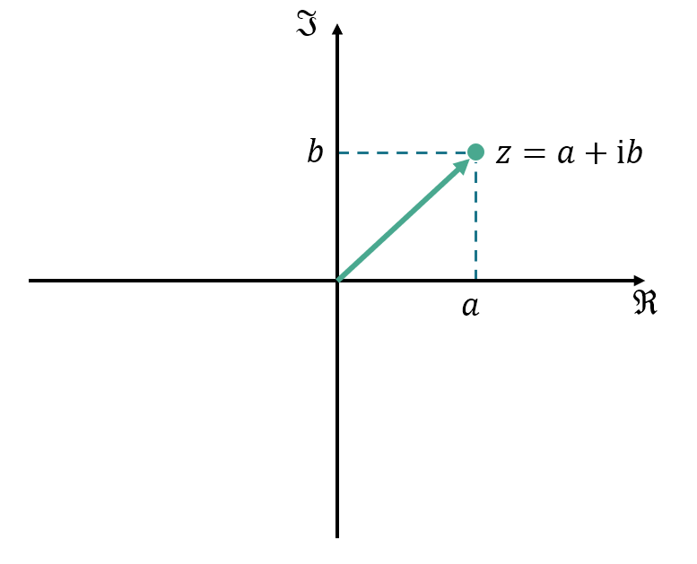
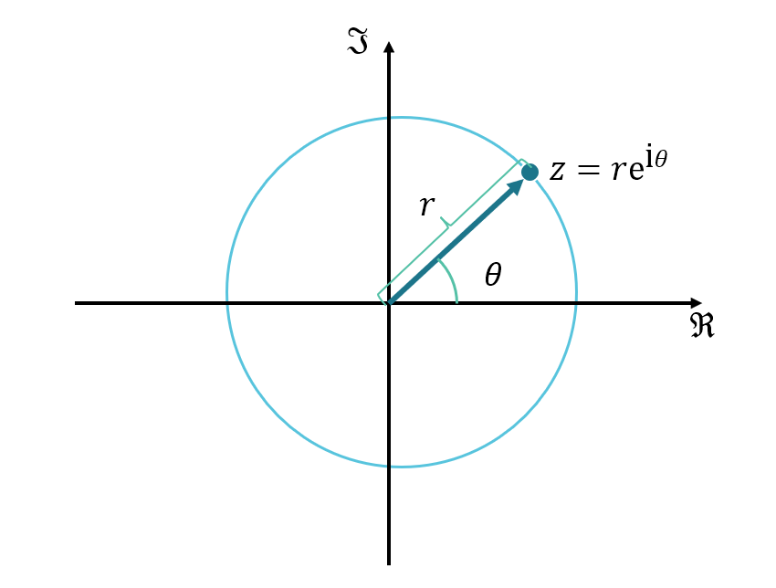
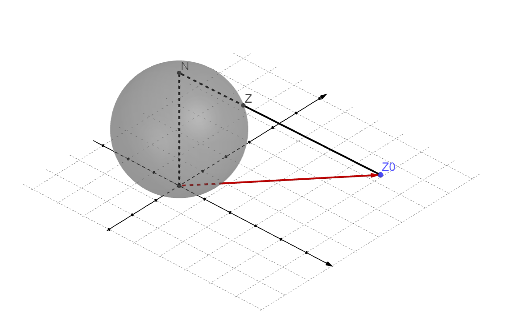
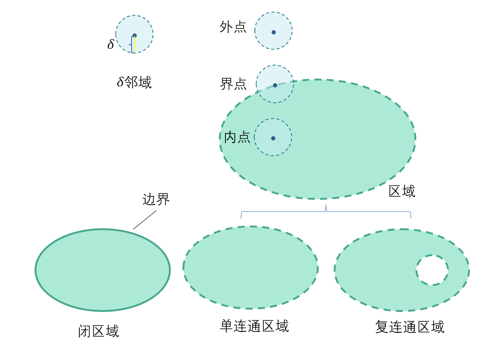
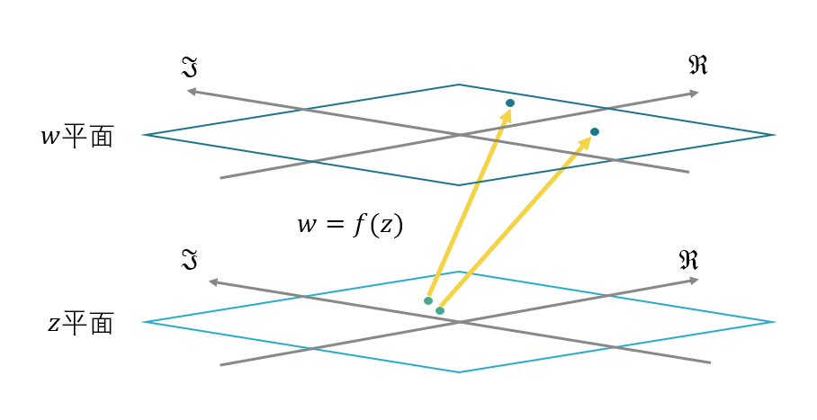
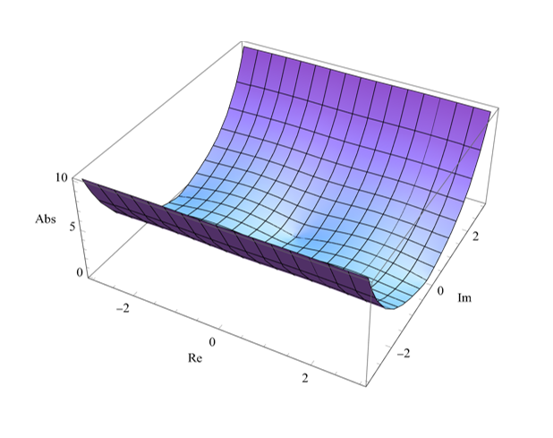
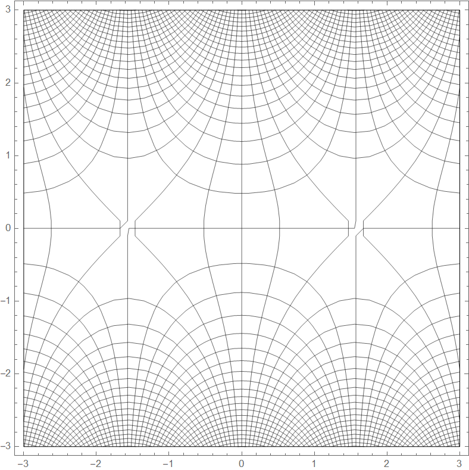
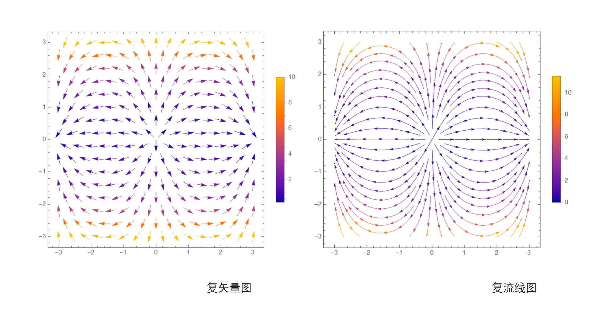
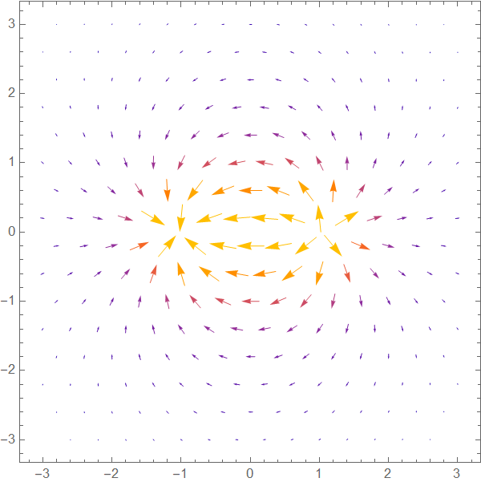

# 浅入浅出复变函数 (初稿)

---

Learn Nothing about Complex Analysis

# 前言

要想成为狂気のマッドサイエンティスト[^0],复变函数是绝对绕不开的关卡.然而对于大部分物理带学生来说, 数物都是道难关. 就数学物理方法中的复变函数部分来说,最终目标是留数定理,但是其他部分的思维方式和数学工具也很重要.对于物理系学生来说,没必要完全了解全部数学细节,能用就成.  本书是对复变函数PTSD的治疗方案，相信看了本文后不仅会不怕复变函数，还能说「给爷来十题」,观看本文前默认你已经会以下知识: 

-   一点数学常识
-   微积分基础
-   多元函数
-   一点点级数基础
-   再懂点线性代数就更好啦

就算全然没有接触过复变函数论也大丈夫[^1],「浅入」就是给没有复数基础的人看的, 看过这本书后能有更不同寻常的理解方式. 

「浅出」是因为学了这本书对你能不能考过《数学物理方法》没有帮助, 看了只能图个乐. 还请各位学生认真学习. 

## 数学标记说明

-   $\mathbb{R},\mathbb{C}$ 这是在表示数域

-   $S,A$ 这是在表示集合

-   $\begin{bmatrix}x\\y\end{bmatrix}$ 这是在表示矢量

-   $\vec v$ 这也是在表示矢量

-   $\mathbf{v}$这也是在表示矢量

-   $(x,y)$ 这是在表示矢量/点

-   $\Re,\Im$ 是指实部,虚部 

-   $Axiomatic$ 说明是公理化表述 

    

# 从复数开始

##  虚数单位 $\mathrm{i}$(Imaginary)

有同学说了，这个咱们高中数学就学过
$$
\mathrm{i}^2 \equiv -1
$$
不过对于初学者看来, 这个非常「抽象」的数学概念怎么就和物理扯上关系了. 特别对物理学生来说, 学个数学概念就一定要联系到物理上,以达到一种「直观」. 其实这种问题在学习复变函数时完全没有必要,下面是常见问题

1.   虚数i的物理意义是什么？

     冇啦, 虚数就是数学用来拓展实数以构成复数域的。不过复数域上有很多运算性质可以用到物理与工程之中。

2.   那我该如何理解复数呢？

     不需要，记住性质和运算就行了。但是有的时候根据其性质和应用情况可以等效成诸如复平面上的矢量等。

得益于虚数的引入, 我们将实数域进行了拓展——复数域.

## 复数域 $\mathbb{C}$

### 这也是复数啊?

>   **Axiomatic定义:复数/复数域**
>
>   **复数(Complex Number)**定义为实数$a, b$组成的有序对, 而其相关之和及积为：
>
>   $(a,b)+(c,d)=(a+c,b+d)$
>
>   $(a,b)\cdot(c,d)=(ac-bd,bc+ad)$
>
>   复数数系是一个域,复数域常以$\mathbb {C} $ 来表示.
>
>   复数域亦可定为代数数的拓扑闭包或实数域的代数闭包.

这是什么东西?怎么和虚数单位$\mathrm{i}$一点关系都没有了?

不要急, 接下来我们将诸如形式 $(a,b)$ 替换为熟悉的 $a+\mathrm{i}b $ 进行计算:
$$
\begin{align}
\mathrm{If\ we\  have}:\mathrm{i}^2&\equiv -1\\
a+\mathrm{i}b +c+\mathrm{i}d  &=a+c +\mathrm{i}(b+d)\\
(a+\mathrm{i}b)\cdot (c+\mathrm{i}d)&=ac+\mathrm{i}ad+\mathrm{i}bc+bd\mathrm{i}^2\\
&=(ac-bd)+\mathrm{i}(ad+bc)
\end{align}
$$
和**定义: 复数/复数域**一致, 也就是说$a+\mathrm{i}b$ 是可以作为复数进行运算的,从发展来说,虚数单位 $\mathrm{i}$ 产生自三次方程的求解, 历史演化后才有复数域 , 随着数学的公理化进程, 复数也被抽象成了上面的模样.

不过公理化还是很有必要的.由于存在矩阵$\begin{bmatrix} a&-b \\b&a\end{bmatrix}$满足 **定义:复数/复数域** 的条件(读者自证), 复数 $a+\mathrm{i}b$ 也可以化成矩阵形式来进行一系列运算.这是一个实用意义不大,但是具有数学意义的表达式. 

如果现在起让大部分学生使用矩阵形式表示复数, 一定会听到许多不满声. 大部分原因是因为矩阵运算太复杂了[^2].我们熟知的 $a+\mathrm{i}b$ 方便,但也不完全方便.这玩意的除法公式长这样:
$$
\frac{x_1+\mathrm{i} y_1}{x_2+\mathrm{i}y_2}=\frac{x_1x_2+y_1y_1}{{x_2}^2+{y_2}^2}+\mathrm{i}\frac{x_2y_1-x_1y_2}{{x_2}^2+{y_2}^2}
$$

要解决这个问题,我们得借助Euler的力量.

此处我们再定义两个函数$\Re(z)$($\mathrm{Re}(z)$)和$\Im(z)$($\mathrm{Im}(z)$):
$$
\begin{align}
z&=a+\mathrm{i}b\\
\mathrm{def}:\Re(z)&\equiv a\\
\Im(z)&\equiv b
\end{align}
$$
我们称实数$a$为复数的**实部**, 实数$b$为复数的**虚部**. 

无论是$z=a+\mathrm{i}b$还是$\begin{bmatrix} a&-b \\b&a\end{bmatrix}$,实质是有序实数对$(a,b)$. 很明显我们想到用 **平面直角坐标系** 来表示每一个复数, 这个平面我们称之为**复平面(Complex plane)**

 

`复平面、复数、矢量示意图`

一般令横轴为实轴$\Re$,纵轴为虚轴$\Im$. 复数$z=a+\mathrm{i}b$可以表示为**复平面中的**矢量.请注意, 学过多元函数的同学不要简单的就将复平面与多元函数联系起来, 此处的「矢量」其实具有相当多的性质. 因此本书的复平面记号也采用的是$\mathbb{C}$而不是${\mathbb{R}^2}$. 但为了方便,我们可以使用**笛卡尔形式**来表示复数:
$$
z=x+\mathrm{i}y
$$

### 救世啊, Euler

>    The most remarkable formula in mathematics. 
>
>    ----Richard Phillips Feynman

**Euler公式:**
$$
e^{\mathrm{i} \theta}=\cos \theta +\mathrm{i}\sin \theta
$$

 更为公众所知的应该是欧拉恒等式$e^{\mathrm{i}\pi} +1=0$,几乎能在各种科普中看到它[^5]. 费曼称之为恒等式为「数学最奇妙的公式」.具体证明[^3]过程略 . 比对Euler公式与刚才复数的形式$z=x+\mathrm{i}y$轻松的可以的到:
$$
\begin{align}
\exists\  r&\in \mathbb{R}\\
\frac{z}{r}&= \frac{x}{r}+\mathrm{i}\frac{y}{r}\\
&=\cos \theta+\mathrm{i}  \sin \theta    \\
&=e^{\mathrm{i}\theta  }\\
z&=re^{\mathrm{i} \theta }
\end{align}
$$
这就是复数的**指数形式**[^6],其中我们称$r$为复数的**模长**, $\theta$为复数的**辐角**.在复变函数的学习中,两种形式是等价的,即:
$$
\begin{align}
re^{\mathrm{i}\theta }&\Leftrightarrow a+\mathrm{i}b\Leftrightarrow z \\
r&=\sqrt{a^2+b^2} =|z|\\
\theta &=\arctan \frac{b}{a}=\arg z +2k\pi \ \ k\in\mathbb{Z}
\end{align}
$$
$|z|$是复数z的**绝对值/模长/幅值**[^7],定义为复数在复平面上与原点的距离;$\arg z$是复数的**主幅角**,是与$\Re$的夹角,且$\arg z\in [-\pi,\pi]$ .

自然的, 我们容易想到将$re^{\mathrm{i}\theta}$ 作为极坐标$(r,\theta)$ 在复平面中进行表示:

`极坐标下的复数`

有了指数形式的复数,我们能极大的简化目前的乘/除法公式:
$$
\begin{align}
z_1\cdot z_2&=r_1e^{\mathrm{i}\theta_1}\cdot r_2e^{\mathrm{i}\theta_2}=r_1r_2 e^{\mathrm{i}(\theta_1+\theta_2)}\\
\frac{z_1}{z_2} &=\frac{r_1e^{\mathrm{i}\theta_1}}{r_2e^{\mathrm{i}\theta_2}}=\frac{r_1}{r_2}e^{\mathrm{i}(\theta_1-\theta _2) }
\end{align}
$$
乘法乘法其在复平面上的表现就是两复数的辐角相加, 模长相乘;除法类似. 而且由于极坐标$\theta$具有周期性, 指数形式的复数也会出现周期性.

### Infinity $\infty$ & Zero $0$

>   **Axiomatic定义:实数/实数域**:
>
>   所有实数的的集合定义为$\mathbb{R}$,则:
>
>   1.集合$\mathbb{R}$是一个域:可以作加、减、乘、除运算, 且有如交换律, 结合律等常见性质
>
>   2.且域$\mathbb{R}$是个有序域, 存在全序关系≥,对所有的实数x, y , z:
>
>   (1) $\mathrm{If:} x\ge y\ \ ,\mathrm{Then}:x+z\ge y+z;$
>
>   (2) $\mathrm{If:} x\ge 0\ \mathrm{and}\ y\ge 0 \ ,\mathrm{Then}:xy\ge 0.$
>
>   3.Dedekind完备性: 任意$\mathbb{R}$的的非空子集$S(S\subseteq \mathbb{R},S\neq \varnothing )$, 若$S$在$\mathbb{R}$内有上界,那么$S$在$\mathbb{R}$内有上确界.
>
>   
>
>   所以无穷大其实不是实数啦...

在$\mathbb{R}$中,0是数轴原点.而在$\mathbb{C}$中,0也是复平面的原点.由于指数形式的特殊性,明显的,复数0的辐角没有明确定义.在笛卡尔形式的复数0定义如下:
$$
z=0\Leftrightarrow \Re(z)=\Im(z)=0
$$

0很简单,但是在接下来的学习中,涉及到$\infty$的都很困难.  在微积分中, 我们已经遇到过不少无限了:在积分中我们需要对无限小作运算;在级数中我们还会使用无穷项数累加.我们不妨如图所示,利用「圆极投影」将实数域$\mathbb{R}$上的每个数**映射**到「圆」上.很明显$\theta$的取值范围应该为$(-\pi,\pi)$,是一个开集. 数学上为了得到实数的「一点紧致化」,我们引入$\infty$,并对应$\theta=\pi $这一点.这样我们的「圆」就具有了连续性.

`通过射影几何得到的扩展实数圆`

我们原有的实数集$\mathbb{R}$加上$\infty$ (「两点紧致化」时是$+\infty$和$-\infty$),构成了我们的**扩展实数集** /广义实数 ,符号记作$\bar{\mathbb{R}}$.由于无穷不满足一般的代数规则,因此扩展实数域不是一个代数域.

有了实数的基础,我们面对复数就要更加轻松. 仿照实数域扩展实数圆的构造, 如下图所示,我们在复平面上方放置一个球/单位球, 并将复平面上的点通过**球极投影**的方式映射到球面上.此时复平面上的点(例$z_0$)应与**除N顶点以外的球面点**(例$z$)一一对应.令N点为 **无穷远点**/无限远点 以补全球面(复平面的一点紧致化),此时的球面称为**复球面**,此时的复球面点的集合由复数域$\mathbb{C}$与无穷远点$\infty$构成,我们称之为**扩充复数**,符号为$\hat{\mathbb{C}}$ . 注意, 由于无穷远点也和一般的代数规则不符,故也不是一个代数域.

`复球面球极投影示意`

也就是说, 无穷远点也不是一个复数. 自然的, 无穷远点的模长为无限大, 其辐角没有明确意义. 

在此后的学习中,我们的讨论会屡次涉及到无穷远点.由于复平面实际不包含无穷远点, 所以在涉及到无穷远点的讨论时, 应使用包含全体扩充复数的复球面. 

### 复数的矩阵形式

一般来说,我们可以把矩阵当作线性变换.在二维平面上, 如果一个矢量左乘矩阵$\begin{bmatrix}x_1&x_2\\y_1&y_2 \end{bmatrix}$ , 可以看作是对整个平面仅经过均匀拉伸、旋转, 将坐标轴的基矢量$\vec{i}$、$\vec j$变换到$\begin{bmatrix}x_1\\y_1 \end{bmatrix}$、$\begin{bmatrix}x_2\\y_2 \end{bmatrix}$后平面的线性变换. [^4]

`线性变换示意` 

由 **Euler公式** 有
$$
e^{i\theta}=\cos \theta +\mathrm{i}\sin \theta
$$
其中 $\cos \theta+\mathrm{i} \sin \theta$ 是一个复数,考虑转换为矩阵形式的复数,就可以得到 $\begin{bmatrix} \cos \theta&-\sin \theta \\\sin \theta & \cos \theta \end{bmatrix}$  ,正好是二维的旋转矩阵——其表现为将矢量逆时针旋转$\theta$.设一个在实轴上的矢量$\begin{bmatrix}r\\0 \end{bmatrix}$,以便与实数$r$对应. 则复数的指数形式$re^{\mathrm{i}\theta}$即为:
$$
\begin{bmatrix} \cos \theta&-\sin \theta \\ \sin \theta & \cos \theta \end{bmatrix}\begin{bmatrix}r\\0 \end{bmatrix}=\begin{bmatrix}r\cos \theta\\r\sin \theta\end{bmatrix}
$$

 这里展示了复数在复平面上其实可以作为旋转矢量来看待. 在复平面上,我们想让矢量转$\theta$,只需要乘上$e^{\mathrm{i}\theta}$即可. 同时,当$r$取1时,$\begin{bmatrix}\cos \theta\\\sin \theta\end{bmatrix}$ 可以看作单位圆上的点, 以后看到$e^{\mathrm{i}\theta}$应该本能的想到单位圆.

由此可见, 复数是个性质很好的计算工具. 这种性质在Fourier/Laplace变换中大放光彩, 同样的在波函数中也有重要的应用, 毕竟不仅能简化公式, 还能方便计算的数学工具谁 能 拒 绝 呢. 由于其旋转的特性, 在处理多值函数时我们也能找到合适的数学工具.

## 复数运算

>   数学没有计算,就像先辈没有林檎,罗马没有张家口,西方没有耶路撒冷.

相信到此时,你对复数的性质已经了解的足够多了. 作为物理系学生, 在实际的应用环节中, 你通常并不是在给别人推销自己所学的知识, 而是陷在计算的深渊之中. 

1.   如何学习复数运算呢?靠刷完吉米多维奇吗?

     你是新时代的大学生了, 应该停止这种无意义的内耗.你所需要的仅仅是记住规则,然后嗯算就行了.

2.   遇到嗯算很难算的怎么办呢?

     用Mathematica算.

### 复数运算法则

对于复数域$\mathbb{C}$来说,这是一个代数数域[^8].故满足以下一般代数规律:

**相等 =**

笛卡尔形式:	$\Re(z_1)=\Re(z_2),\Im(z_1)=\Im(z_2)\Leftrightarrow z_1=z_2$

**加法   + **

交换律:		$z_1+z_2=z_2+z_1$

结合律:		$(z_1+z_2)+z_3=z_1+(z_2+z_3)$

**乘法   $\cdot$**  

交换律:		$z_1\cdot z_2=z_2\cdot z_1$

结合律:		$(z_1\cdot z_2)\cdot z_3=z_1\cdot(z_2\cdot z_3)$

分配律:		$z_0\cdot(z_1+z_2)=z_0\cdot z_1+z_0\cdot z_2$

和实数具有一样的运算规律呢. 

### 共轭复数

对于复数$z=x+\mathrm{i}y$,我们将其虚部$\Im$取相反数, 从而得到的在复平面上与原复数关于实轴轴对称的复数,我们称之为**共轭复数**,记作$\bar {z}$.
$$
\begin{align}
z&=x+\mathrm {i}y=re^{\mathrm{i}\theta  }\\
\bar{z}&=x-\mathrm{i} y=re^{-\mathrm{i}\theta }   
\end{align}
$$
其有以下性质:
$$
\begin{align}
1.&\ z\cdot\bar{z}={|z|}^2;\\
2.&\ \bar{\bar{z}}=z\ ;\\
3.&\ \overline{z_1\pm z_2}=\bar{z_1}\pm \bar{z_2}\\
4.&\ \overline{z_1 \cdot z_2}=\bar{z_1}\cdot \bar{z_2}\\
5.&\ \overline{(\frac{z_1}{z_2}) } =\frac{\bar{z_1}}{\bar{ z_2}} 
\end{align}
$$
在平时会经常利用性质1来求复数的模长. 

### 模与辐角运算

我们首先回顾复数三种形式的互换

>复数的**笛卡尔形式**、**三角形式**、**指数形式**
>$$
>z \Leftrightarrow x+\mathrm{i}y \Leftrightarrow r(\cos \theta +\mathrm{i}\sin \theta)\Leftrightarrow re^{\mathrm{i}\theta  }
>$$

其模与辐角的运算应具有如下规则:
$$
\begin{align}
|z_1\cdot z_2|=|z_1||z_2|,\left | {\frac{z_1}{z_2}} \right |=\frac{|z_1|}{|z_2|}\ \  (z_2\neq 0)\\
\arg(z_1\cdot z_2) =\arg z_1+\arg z_2\\
\end{align}
$$
且满足三角不等式(请读者自证):
$$
\begin{align} |z_1|+|z_2|&\ge|z_1+z_2| \\|z_1|-|z_2|&\le |z_1-z_2|\end{align}
$$

---

一般的教材到此时就该讲复数的幂次与开方了. 但由于本书认为数物中所学的幂次/开方实际上是初等复变函数,故不置于复数运算中讲解.

# 进入函数世界

如果用林檎来进行比喻,  那么在学习函数前就是关心林檎具体的数量, 而引入函数后我们关心的就是林檎与林檎树之间的关系以及这种关系的性质. 数学中起决定因素的其实不是元素本身，而是元素之间的关系. 自然的,在学习复变函数的过程中, 我们会引入函数的概念到复数域中.

## 复变函数 

### 对它使用函数吧

我们首先回味一下函数的定义:

>   **Axiomatic定义: 函数**:
>
>   有从输入值集合$X$到可能的输出值集合$Y$的一个**函数**$f$(记作$f:X\rightarrow Y$)是一个关系,满足以下条件:
>
>   1.$f$是**完全**的: 对于集合$X$中任意元素$x$都有集合$Y$中的元素满足$y=f(x)$.
>
>   2.$f$是**多对一**的:  多个输入可以映射到一个输出,但一个输入不能映射到多个输出.

很明显的,要想在复数域上使用函数, 只需要把输入值集合$X$与输出值集合$Y$扩展到复数域上就行.这就是**复变函数**,我们记作:
$$
w=f(z)\ \ \ \ (z\in D)
$$
称$z$为**自变量**,$D$为**定义域**.对于复变函数来说, 自变量与因变量也可以可以分为实部与虚部:
$$
\begin{align}
z&=x+\mathrm{i}y;\ \ \ \ \ x,y\in\mathbb{R}\\	
w&=f(z)=u(x,y)+\mathrm{i}\ v(x,y) ; \ \ \ u,v\in\mathbb{R}
\end{align}
$$
其中$u,v$是函数$f(x)$的成分.复变函数$w=f(z)$可以看作是两个实变函数$u,v$的有序对.

### 点,点集与区域

由于本段概念非常显然,我们直接给出定义

>   **Definition:Gebiet**. Eine offene Punktmenge heißt zusammenhängend, wenn man sie nicht als Summe von zwei offenen Punktmengen darstellen kann. Eine offene zusammenhängende Punktmenge heißt ein Gebiet.
>
>   — Constantin Carathéodory, (Carathéodory 1918, p. 222)

这段是历史上对于**区域(Domain)**的定义.译文:「如果一个开集不能表达为两个开集的和,就说明这个开集是**连通**的.这个**开集**称为区域」. 这个定义转为更加现代化的表述就是如下:

**定义:$\delta$邻域**
$$
U(a,\delta)=\{ x|\ |x-a|<\delta \}
$$
**定义:去心邻域**
$$
U_0(a,\delta)=\{x|\ 0<|x-a|<\delta \}
$$
**定义: 区域**

设有非空平面点集$D$,如满足:

1.   **开集性**:在$D$中的每一点$z$, 存在$\delta$邻域全含于$D$;
2.   **连通性**:在$D$中任意两点都能用折线连接起来,且折线上的点都属于$D$.

则称$D$为**区域**.

邻域也是区域.

同时我们快速给出以下定义:

**定义:内点/外点**

若点$z$存在邻域全含于$D$,则称为**内点**,也称点$z$**属于**$D$;

若点$z$存在邻域全不含于$D$,则称为**外点**;

**定义:界点/边界**

若点$z$不属于$D$,但其任意邻域包含$D$的点,则称为**界点**.

$D$所对应的界点的集合叫做$D$的**边界**.

**定义:闭区域**

区域与其边界的并集称为**闭区域**,记作$\overline{D}$

**定义:单连通区域/复连通区域**

若区域内任何一条全含于区域的简单闭合曲线都能收缩为一点,则称为**单连通区域**.

反之为**复连通区域**.

以上内容关系如下:

`邻域/区域/闭区域示意`

### 复变函数可视化

对于之前所学的一元函数多元函数来说, 函数图像无疑是非常方便的分析工具: 我们可以从图像中直观的看到函数的零点,看得出函数的变化趋势, 看得出积分区域的实际意义(面积/体积).可以说, 函数图像为函数赋予了集合直观. 然而这种直观在复变函数中遇到了挑战: 我们知道复变函数实际上是两个复数域的一种映射:

`z平面向w平面的函数`

在表示一元函数$y=f(x)$的图像时, 实际上是表示在二维平面上点$(x,f(x))$的集合; 表示二元函数$z=f(x,y)$时, 表示的是在三维空间中$(x,y,f(x,y))$点的集合. 如果要我们表示$w=u+\mathrm{i}v=f(x,y)$的话,我们就需要在四维空间中表示$(x,y,u(x,y),v(x,y))$点的集合了.我们只能感受三维空间, 是不是就没有办法了呢?

我们使用$w=\sin z$作为实例进行演示.我们可以将三维空间的x轴,y轴作为z平面的实轴与虚轴. 将z轴设定为函数$w=f(x,y)$的模长$|w|$,这样就只用表示$(x,y,|f(x,y)|)$在三维空间中的点了.

`|sin(z)|的图像`

但是这种可视化方法也有缺点:由于将因变量$w\in \mathbb C$换成了一个实数来表示, 进行了「降维打击」, 函数图像也会损失了一些信息(如辐角等). 此时的函数图像具有的性质实际上就不多了.

让我们换个思路, 总之都是复平面到复平面,借助之前线性变化的方法, 如果我们把原来平面上的网格的每一个点移动到变换后的位置,是不是也能表示复变函数呢?如此我们可以绘制网格图. 

`sin(z)的网格图`

如果我们把因变量$w=u+\mathrm{i}v$看成一个在复平面上的矢量$\mathbf{w}=\begin{bmatrix}u\\v \end{bmatrix}=f(x,y)$,那此时我们就得到了一个复平面上的矢量场:
$$
\mathbf{w}=\mathbf{F}(x,y)
$$
如此, 我们可以在复平面上$(x,y)$点上画出矢量$\begin{bmatrix}u\\v \end{bmatrix}$. 当然如果直接画矢量的话, 它们会互相遮挡, 所以我们将长度缩短,并用颜色来区分其模长. 如此我们就能得到复矢量图/复流线图:

`sin(z)的复矢量图与复流线图`

虽然有如此多的方法对复变函数进行可视化,但与之前一元函数中图像的作用相对比,无论哪一种方法的实用性都大不如从前.事实是, 我们正在失去几何直观.

不过这些可视化在此后依然有其应用价值,我们将会在后续篇章讲解.

## 解析函数

复变函数实际上是一个很广泛的概念, 其中不乏有一些难以研究或缺少应用价值的.对于学物理的同学而言, 只需要研究其一类具有「神奇」特性的函数——复变函数. 

### 微分之前

微分探讨的是自变量发生微小变动时, 因变量的变动情况. 这里有两个关键点: 一是如何取到足够小,小到极限那种;另一点是函数是否连续保证我们能得出其变动情况. 在一般的微积分学习中,路线是 极限->连续性->导数 ->微分 .这套流程照样可以搬到复变函数上.我们的重点是解析,这里主要以引入为主, 除了必要的推导,一般不做证明.

**定义:极限**

设函数$w=f(z)$在$z_0$的去心邻域$0<|z-z_0|<\rho$内有定义,$\exists A\in \mathbb{C}$,使$\forall\varepsilon>0,\exists \delta >0,$对满足$0<|z-z_)|<\delta (0<\delta\leq\rho)$的一切$z$,都有:
$$
|f(z)-A|<\varepsilon
$$
则称$A$为函数$f(z)$当$z$趋于$z_0$的**极限**,记为:
$$
\lim_{z\rightarrow z_0} f(z)=A
$$
**定义:连续**

若$z_0\in D$定义域,有$\lim\limits_{z\rightarrow z_0}=f(z_0)$,则称函数在这一点连续.

下面引入Cauchy的定义

>   $\varepsilon-\delta$**定义:连续**
>   $$
>   \begin{align}
>   \mathrm{For:} &\ f(x)\ \ (x\in D
>   );c\in D, \varepsilon,\delta \in\mathbb{R};\\
>    &\forall  \varepsilon >0,\ \exists \delta >0 \\
>   \mathrm{If:} &c-\delta <x<c+\delta \\
>   \mathrm{Then:} &f(c)-\varepsilon <f(x)<f(c)+\varepsilon 
>   \end{align}
>   $$
>   称函数在这点连续.

>   $\varepsilon-\delta$**定义:一致连续**
>   $$
>   \begin{align}
>   \mathrm{We\ have:}&(X,d_1) \ (Y,d_2)\\ 
>   \mathrm{} &\ f:X\rightarrow Y\ \ ;x,y\in D, \varepsilon,\delta \in\mathbb{R};\\
>    &\forall  \varepsilon >0,\ \exists \delta >0 \\
>   \mathrm{If:}&d_1(x,y)<\delta  \\
>   \mathrm{Then:} &d_2(f(x),f(y))<\varepsilon 
>   \end{align}
>   $$
>   则我们称函数一致连续.
>   
>大致来讲是描述对于函数 $f(x)$我们只要在定义域中让**任意**两点 $x$ 跟$ y$ 越来越接近，我们就可以让 $f(x)$ 跟 $f(y)$ 无限靠近.

1

### 解析のレヴュー[^9]

>   わかります(指可微)

### 如果...不解析呢 | 解析的性质

### 调和的「巧合」

回顾前章将复变函数看作一个矢量场的想法:
$$
\begin{bmatrix}u\\v\end{bmatrix}=\begin{bmatrix}u(x,y)\\v(x,y)\end{bmatrix}=f(x,y)
$$
对于解析函数来说, 既然其分量的实部与虚部都是调和函数, 有没有可能这个矢量场是一个调和场?这个我们不难证明.

令函数为复平面上的一个场:$\mathbf{w}(x,y)=u(x,y)\mathbf{\hat  i}+v(x,y)\mathbf{\hat j}$,可得其散度/旋度:
$$
\begin{align}
\nabla \cdot\begin{bmatrix}u\\v\end{bmatrix}&=\frac{\partial u}{\partial x}+\frac{\partial v}{\partial y}\\
\nabla \times  \begin{bmatrix}u\\v\end{bmatrix}&=\frac{\partial u}{\partial y}-\frac{\partial v}{\partial x}  
  
\end{align}
$$
由Cauchy-Riemann条件:
$$
\begin{align}
\frac{\partial u}{\partial x} &= \frac{\partial v}{\partial y}\\
\frac{\partial v}{\partial x} &= -\frac{\partial u}{\partial y}\\
\end{align}
$$
带入后不难发现,其实场$\mathbf{w}$并不是一个无旋无源的场, 不仅有散度还有旋度.(想要找反例的读者可以想想$f(z)=z$在$z=0$ 处的散度).所以这只是个误会吗?

**Naive!**我们考虑对Cauchy-Riemann条件进行变形:
$$
\begin{align}
&\frac{\partial u}{\partial x} = \frac{\partial v}{\partial y};
\frac{\partial v}{\partial x} = -\frac{\partial u}{\partial y}\\
&\frac{\partial u}{\partial x}  - \frac{\partial v}{\partial y} = 0;\frac{\partial v}{\partial x}  + \frac{\partial u}{\partial y} = 0\\
\end{align}
$$
容易观察到:
$$
\begin{align}
&\frac{\partial u}{\partial x}  - \frac{\partial v}{\partial y} =\frac{\partial u}{\partial x}+\frac{\partial (-v)}{\partial y}  = \nabla \cdot \begin{bmatrix}u\\-v\end{bmatrix}=0;\\
&\frac{\partial v}{\partial x}  + \frac{\partial u}{\partial y} =\frac{\partial u}{\partial y}-\frac{\partial (-v)}{\partial x}  = \nabla \times \begin{bmatrix}u\\-v\end{bmatrix}=0;\\
&\begin{bmatrix}u\\-v\end{bmatrix}=\overline{\mathbf{w}}
\end{align}
$$
综上, 解析函数的复共轭函数所对应的矢量场正是一个**调和场**.其分量$u,-v$同样也是**调和函数**.而完成这一步之差一个**复共轭**操作.

接下来我们来应用一下.先来回忆一下流程:

1.   取共轭函数
2.   绘制复矢量图

其实很简单是吧,随后我们随便想一个函数,就:
$$
f\left( z \right) =\frac{1}{z-1}+\frac{-1}{z+1}
$$
我们绘制出其复共轭函数的复矢量图:

q

>   **插曲:**在学习矢量分析的时候, 我们接触到了诸如梯度场无旋, 旋度场无源等概念.在经历了无源无旋场(调和场)/有源无旋场/有旋无源场的轮番轰炸下,这些概念逐渐变得混乱. 当时有人称问我有没有「有源有旋场」, 一时间由于大脑的混沌状态并没有给出答案, 事后仔细一想:
>
>   **不 就 是 冲 马 桶 吗**
>
>   从此以后有源有旋场多了个「**马桶场**」的外号.

### 多值化的处理

### 初等解析函数

## 解析的应用

### 解析性质的意义

### 物理应用

# 附录

## 后记

## 参考资料

1.   冉扬强.数学物理方法.西南师范大学出版社.IBSN 978-7-03-037590
2.   张 筑生. 数学分析新讲（第一册）. 北京大学出版社. 1990.
3.   Б.П.吉米多维奇.数学分析习题集.20高等教育出版社.202010
4.   González, Mario O. (1992). Classical Complex Analysis. CRC Press. p. 19. ISBN 9780824784157.
5.   [维基百科 - wikipedia.org](https://zh.wikipedia.org/)的诸多条目
6.   [小时百科 - wuli.wiki](http://wuli.wiki)的诸多条目
8.   山田忠雄.新明解国語辞典.三省堂.昭和四十七年(1972)

>   **Log：**
>
>   2021/12/25
>
>   本文正式开始写了
>
>   2021/2/6
>
>   写完第一章了
>
>   2021/2/7
>
>   新增了参考资料

[^0]: 疯狂科学家
[^1]: 没关系
[^2]: 小部分原因是大家的矩阵运算都不熟练

[^3]:此次强调, 有云「用泰勒级数来验证Euler公式」, 其实是一种错误的说法:由于在复数域中的泰勒级数展开、求导等运算均需要用到Euler公式, 造成循环论证, 所以这种方法只能是Euler公式的验证方法.

[^4]: [【官方双语/合集】线性代数的本质 ](https://www.bilibili.com/video/av6731067)

[^5]: 也适合用来鼓吹封建迷信,「上帝存在的证明」啥的.

[^6]: 本书中指数表示在复平面上表示时自动转换为三角表示(极坐标表示),故不作区分.

[^7]: 是的,复数的模可以称为绝对值. [绝对值 - wikipedia.org](https://zh.wikipedia.org/wiki/绝对值#复数的绝对值)

[^8]:域是装备了两个二元运算(通常称之为「加法」、「乘法」）的代数系统.这两种运算各自满足结合律与交换律, 完全可逆, 同时乘法对加法满足分配律.

[^9]:Revue[フ]ダンス・音楽を主とし、寸劇などをはさんで、場面を次つぎに変えて行く、はなやかなショー。 

